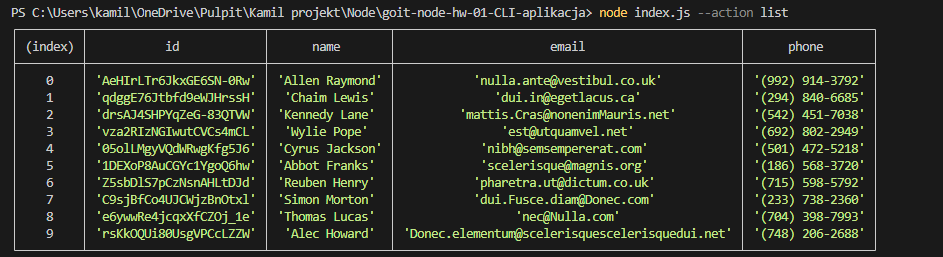
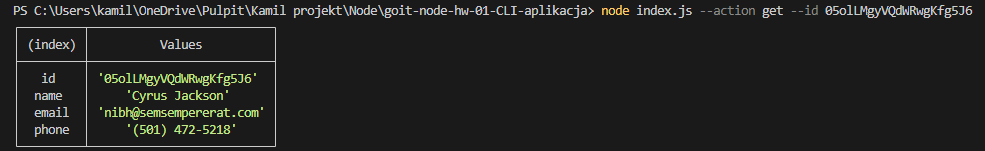
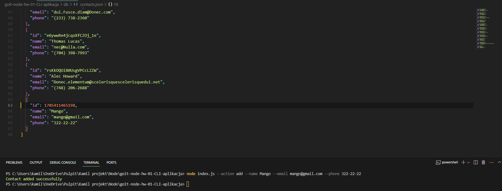
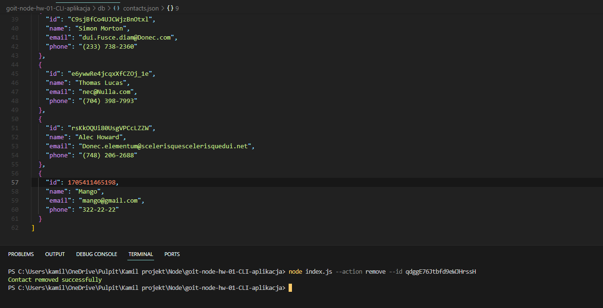

# Contacts application

The application for which allow to manage your list of contacts.

## Features

### Display the contact list

### Fetch contact

### Add contact

### Remove contact

## Usage

- To display a list of all contacts, use the command: node index.js --action list
- To fetch detailed information about a specific contact, use the command along with its ID: node index.js --action get --id " "
- To add a new contact, use the command: node index.js --action add --name Mango --email mango@gmail.com --phone 322-22-22
- To remove a contact based on its ID, use the command: node index.js --action remove --id " "
